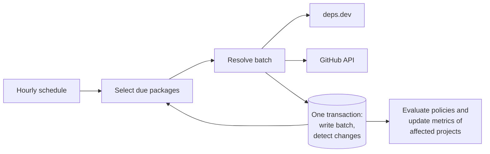

| Status   | Date       | Author(s)                              |
|:---------|:-----------|:---------------------------------------|
| Proposed | 2026-09-29 | [@Nihad74](https://github.com/Nihad74) |

## Context

Dependency-Track can see vulnerabilities, licenses, and package age. It cannot see whether the
package's source repository is maintained. [OpenSSF Scorecard] and repository metrics answer that
question, but they are slow to fetch and they describe the repository now, not one package version.

The same package appears in many projects. A large bill of materials can contain thousands of
packages. Calling GitHub or [deps.dev] once per component would repeat the same work and hit rate
limits. Package metadata already has one row per package URL without a version. Health data
belongs next to that row, not next to each component.

Policy authors need a way to act on that data. A missing value must stay missing. Treating it as
zero would create violations for packages that have not been fetched yet.

Both data sources are public services outside the deployment. Every request tells them the name
of a package. Many organizations treat the names of their internal packages as confidential, and
some deployments have no internet access at all.

### Possible Solutions

#### A: Fetch health while the project is analyzed

Start the external calls from project analysis, using the project UUID that the upload already has.

*Pro*: The project UUID is already known. No later search for projects is required.

*Con*: Analysis would wait on GitHub and deps.dev. A shared package would be fetched once per
project. Package metadata might not exist yet, and the health row has a foreign key to it.

#### B: Store health on the package and refresh it in its own scheduled workflow

Write health only after package metadata exists. A scheduled workflow selects packages that have
no health row, or whose last fetch is at least 24 hours old. When a value that a policy can read
changes, evaluate policies for the projects that use the package.

*Pro*: One fetch serves every project that uses the package. The foreign key is satisfied.
Project analysis stays independent of the external APIs.

*Con*: A new policy does not see health until the next fetch. Finding the affected projects
requires a query from the package back to components.

#### C: Add health to the existing package metadata resolution

Package metadata resolution already visits every package on a schedule. It could also call deps.dev
and GitHub.

*Pro*: No second workflow and no second candidate query.

*Con*: Package metadata resolution talks to the package repositories that an administrator
configured, such as an internal Maven mirror. Health talks to two fixed public services with their
own rate limits. A GitHub rate limit would then also delay the latest version lookup. The two
also need different refresh rhythms.

## Decision

We will choose option B.

### Storage

We will store package health on the package URL without version, qualifiers, or subpath. One table
holds the health record of a package. A second table holds the individual OpenSSF Scorecard checks
of that package. The health table has a foreign key to the package metadata table, and deleting
package metadata also deletes its health record and its checks. This keeps one rule for how long
package data is kept: the existing package metadata maintenance decides it.

The new tables are only read and written through JDBI with plain SQL, as required for new
persistence code. They do not have JDO model classes. The component list queries of the REST API v2,
the component health resource, and component policies read health the same way as package metadata:
through the package artifact metadata of the component. A component gets health once its artifact
metadata has been resolved, and the lookup that re-evaluates projects after a health change finds
exactly those components.

Each health record has a status. `PROCESSED` means the external services returned data.
`NOT_AVAILABLE` means there was nothing to fetch, for example because the package is unknown to
deps.dev or is internal, or because its first fetch failed. A `NOT_AVAILABLE` record still has a
fetch time, so the package is not asked again for 24 hours. Policies and the component lists only
read `PROCESSED` records.

Every refresh replaces all scorecard checks of a package. Reads and writes happen for a whole batch
of packages at a time, not one package at a time.

### Fetching

The `apiserver` triggers the workflow every hour. One workflow instance runs at a time. It selects
packages that have package metadata, a type that deps.dev supports, and either no health record or
a last fetch that is at least 24 hours old. The hourly trigger keeps the real refresh interval close
to 24 hours. A daily trigger would refresh most packages only every 48 hours.

For each batch, the external calls finish before the batch is written in one database transaction.
When a service answers with a rate limit, the packages fetched so far are written, and the workflow
waits until the limit resets before it fetches the rest of the batch. The wait happens in the
workflow, so it does not use up the retries that are meant for real failures. GitHub's primary and
secondary rate limits are both recognized, and a 429 response without a reset time waits one minute.
If three waits in a row resolve none of the remaining packages, the workflow skips them. They stay
due and are fetched again by the next scheduled run, so one package cannot hold the workflow forever.
A package whose fetch fails for another reason, for example a server error or a response that
cannot be read, gets its fetch time recorded, and the rest of its batch is still written. A package
without a health record gets a `NOT_AVAILABLE` record; an existing record keeps its values. Either
way the package is due again 24 hours later, not at the next hourly run, and a failure neither
clears health that policies act on nor starts policy evaluation.
Cancellation surfaces as an interrupt, not as a failure that is retried.

### External services and data that leaves the server

We will use two external services.

* **deps.dev**, without authentication. It provides the default version, the number of dependents
  of the default version, the source repository, project data such as stars and forks, and the
  OpenSSF Scorecard result.
  Supported package types are npm, Go, Maven, PyPI, NuGet, Cargo, and RubyGems. For source
  repositories on github.com, we also call the endpoint behind the deps.dev project page
  (`https://deps.dev/_/project/GITHUB/<owner>/<name>`). It returns when deps.dev last observed the
  project data, which the public API does not provide. This endpoint is not part of the public API
  and may change without notice. If it fails, the project data is kept and only that time is absent.
* **The GitHub REST API**, only for source repositories hosted on github.com. It provides archive
  state, open issues and pull requests, contributors, commit frequency, bus factor, last commit,
  file count, and whether the repository has a README, a code of conduct, and a security policy.
  GitHub is only called when an enabled GitHub repository with authentication and a github.com URL
  is configured. Its token is reused. Tokens of GitHub Enterprise Server repositories are never sent
  to github.com. Without such a repository, the GitHub fields stay empty. That is not an error.

Repositories on other hosts, such as GitLab or Bitbucket, only get the data that deps.dev returns.

Requests send the package type, namespace, name, and version to deps.dev, and the repository owner
and name to deps.dev and GitHub. **Internal packages are never sent.** A package is internal when it
matches the configured internal component patterns. This is the same rule that package metadata
resolution uses to keep internal packages away from public repositories. An internal package gets a
`NOT_AVAILABLE` record without any external call. Requests go through the configured HTTP proxy.

### Turning the feature off

The feature is enabled by default, so that health policies work without extra setup. Administrators
can turn it off with the `package-health.enabled` setting. When it is off, the scheduled workflow
does not start and no request leaves the server. A run that is already in progress checks the
setting before each batch and stops. Deployments without internet access should turn it off.
Otherwise every run sends a request for each due package, each request fails, and the packages are
skipped until the next run. With the feature off, stored health stays in the database but is
hidden: the component lists return no scorecard score, the health resource returns 404, and health
conditions do not match, so violations they reported earlier are cleared.

### Policies

Component policies can read a `health` value. The fields are the scorecard score, the scorecard
check name and score, stars, forks, dependents, bus factor, commit frequency, last commit, average
issue age, and whether the repository is archived. Other stored values stay off the policy type.
A field that was not fetched stays absent. It is not zero, and it does not by itself create or
clear a violation.

When a policy field or a check score changes, Dependency-Track evaluates policies and updates
metrics for projects that contain the package and have an applicable condition that reads `health`.
Vulnerability analysis stays on project analysis.

### REST API

The REST API v2 gets a component health resource that returns the full stored record. That
resource is separate from the policy type. The component lists also return the scorecard score and
can be sorted by it.

### Out of scope

* Health per package version. All versions of a package share one record.
* Repository metrics from code hosts other than GitHub.
* Health in the REST API v1 and in the user interface.
* Policy access to open issues, open pull requests, file count, and the README, code of conduct,
  and security policy flags. Only the REST API returns them.

## Consequences

Shared packages are fetched once. Projects that import the same package see the same health record.

A policy saved before the first fetch does not match until health arrives and the policy run
starts. An unchanged refresh updates the fetch time and does not start policy evaluation. Average
issue age and commit frequency move with time alone, so small changes in them count as unchanged.
A policy that compares them with a threshold sees the crossing at its next evaluation, not at
the refresh.

The project lookup repeats the existing rules for which policies apply to a project, so a limited
policy does not schedule every project that contains the package. It finds conditions that read
health by searching their text for `health.`. This can schedule a project too often, for example
when a string in the condition contains that text. It never misses a condition that reads health.

The external services set the pace. A package costs three to six requests to deps.dev. A GitHub
repository costs at least eight requests, more for repositories with many open issues or
contributors. All GitHub requests count against the hourly [GitHub rate limit] of the configured
token. For a personal access token, that limit is 5,000 requests per hour. Tokens of GitHub Apps
that a GitHub Enterprise Cloud organization owns get a higher limit. The first full pass over a
large portfolio can therefore take hours. Each `apiserver` instance keeps fetched GitHub
repositories in memory for one hour, so packages that share a repository cost one set of GitHub
requests in that hour. Separate instances do not share that memory.

Internal packages and packages of unsupported types never get health data. Health conditions do
not match them.

Package names that are not internal now leave the deployment by default. Administrators who do not
want that must turn the feature off.

[deps.dev]: https://deps.dev
[GitHub rate limit]: https://docs.github.com/en/rest/using-the-rest-api/rate-limits-for-the-rest-api
[OpenSSF Scorecard]: https://securityscorecards.dev
